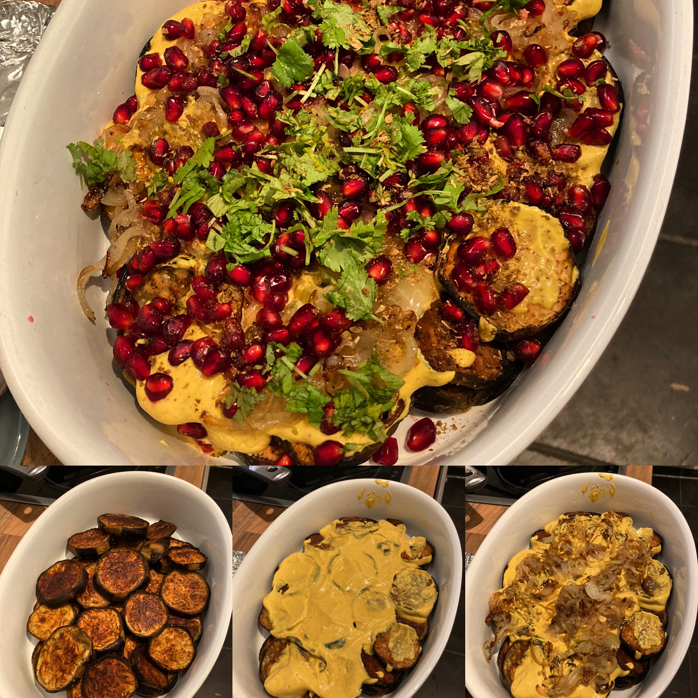

## Hello World

During my normal work day I spend quite some time reading coding related blog posts and
skimming through questions on Stackoverflow (and - if time permits - answering some [R or shiny related questions](https://stackoverflow.com/search?q=%5Br%5D+or+%5Bshiny%5D+user%3A4125751+is%3Aanswer)). 


When I learn about a new topic or technique it can happen that I jump from one article to
another (and more often than not get side-tracked by yet another topic 🤦️). 
In one of those scavenger hunts I ended up reading on 
[Blogdown](https://bookdown.org/yihui/blogdown/) and a quote was catching my attention:

> If you don’t have a website nowadays, you don’t exist.

Being utterly exaggerated, there is a grain of truth in it. I used to have a website 
since my early days at university, but never really bothered to keep it updated or 
even remotely interesting. Maybe it was due to a lack of imagination of which content I
could possibly produce, which is of any interest.

However, in my professional life I gained quite some knowledge about R and related 
eco systems (such as `shiny` or lately -- to a much smaller degree -- `Javascript`). Maybe 
this is the content I was  looking for? If I just had a system to easily post code 
snippets...

Wait a minute, did I not just read about blogdown? Very well, so here my journey starts. 
I try to post code snippets or interesting solutions, libraries or challenges I see in my 
day-to-day life with the hope that they may help somebody, like the many posts I read so 
far helped me.

The last thing left is to produce the ubiquitous `Hello World` snippet (maybe in a 
nerdier way then usual):

```{r hello-world}
hello_world <- c(8L, 31L, 38L, 38L, 41L, 53L, 23L, 41L, 44L, 38L, 30L, 54L)
print(paste(c(LETTERS, letters, " ", "!")[hello_world], collapse = ""))
```

P.S. Of course I did not start to count the letters by hand, but cheated a bit and 
actually created the indices by:

```{r create-indices, eval = FALSE}
match(strsplit("Hello World!", "")[[1]], c(LETTERS, letters, " ", "!"))
```

P.P.S. To spice up things a bit I may also share some cooking related posts from time to
time in case you get hungry in between your coding sessions. Also here a `Hello World`:

{width=50%}


